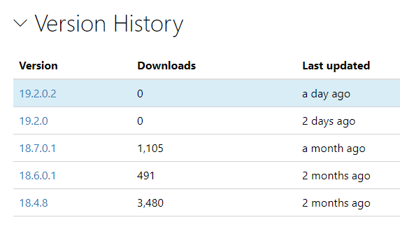
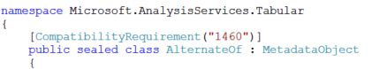

# List new features in TOM Library

This week, a new version (19.2.0.2) of the Tabular Object Model (TOM) was [released on NuGet](https://www.nuget.org/packages/Microsoft.AnalysisServices.retail.amd64/). In fact, this is a major version jump from the previous 18.7 release:



Those updates have been more frequent recently, and they usually coincide with new features coming to Azure Analysis Services or Power BI (Premium), and allow open-source tools like [Tabular Editor](https://tabulareditor.com/) to support those features.

So, those releases are generally very happy occasions and allow to become more productive with the wider Power BI ecosystem. However, it has always bothered me that the AMO/TOM libraries come with very sparse documentation, and virtually no change log or release notes. Lots of the functionality has to be discovered the hard way by trial and error.

The 19.x version number has made me particularly curious this time, and I wanted to know more. I remembered from previous use of TOM that I would occasionally receive a `CompatibilityViolationException` when running some code against an older on-prem Tabular server, for instance.

Taking a quick look inside reveals that certain parts of the API are annotated with an `CompatibilityRequirement` attribute:



The number referenced there clearly corresponds to the well-known [Compatibility Level for tabular models](https://docs.microsoft.com/analysis-services/tabular-models/compatibility-level-for-tabular-models-in-analysis-services). *Remember, 1200 was the level that properly kicked off tabular modeling with the introduction of TMSL, and 1400 was another milestone with the [introduction of M/PowerQuery integration into Tabular and structured data sources](https://docs.microsoft.com/archive/blogs/analysisservices/supporting-advanced-data-access-scenarios-in-tabular-1400-models).*

Since the tight integration between Analysis Services and Power BI, quite a few new compatibility levels have been introduced, very recently 1520 in conjunction with the [enhanced PBIX metadata format](https://docs.microsoft.com/power-bi/desktop-enhanced-dataset-metadata).

So it didn't take very long to write a little LinqPad script to automatically extract and list all TOM API elements that happen to be annotated with that `[CompatibilityRequirement]` attribute.

Turns out the attribute internally distinguishes three different scopes, namely: "Box" (presumably on-prem SSAS), "Excel", and "Pbi". Since 1400 has been around for a long time now, the results are split into two tables below: All features introduced after 1400 first, then all others that are marked with _1200_, _1400_, or _Unsupported_.

How to read this? To take an example, the features around [Calculation Groups](https://www.sqlbi.com/articles/introducing-calculation-groups/) were introduced with level `1470` (which is also mentioned in [Kaspar's blog post here](https://www.kasperonbi.com/adding-calculation-groups-to-aas-or-pbi-premium/)). However, the ability to define a custom sort order for calculation items via the `Ordinal` property was only introduced with the `1500` level, hence requires a model at that level and a server that supports it as well.

Having checked one of our production Azure Analysis Services servers, they currently report those _SupportedCompatibilityLevels_: `1100,1103,1200,1400,1450,1455,1460,1465,1470,1475,1480,1500,1510,1520,1530,1000000`, i.e. go up as far as **1530**.

Hence, it is very interesting to see one item listing "1535" below (`MAttributes`), and even some explicitly marked as "Preview" (`AnalyticsAIMetadata`).

What is going to be announced here??

In any case, I hope this helps some folks (like myself) getting a bit more clarity about the features supported by the TOM API, and how those relate to the various new compatibility levels that were introduced post-1400.

The script used here is provided at the bottom, and can easily be re-run with any future releases appearing on NuGet!

## Table 1: Post-1400 Features

| Name | MemberType | Box | Excel | Power BI |
| :--- | :--- | --- | --- | --- |
| AlternateOf | Class | 1460 | 1460 | 1460 |
| AlternateOfAnnotationCollection | Class | 1460 | 1460 | 1460 |
| AnalyticsAIMetadata | Class | Preview | Preview | Preview |
| AnalyticsAIMetadataCollection | Class | Preview | Preview | Preview |
| BasicRefreshPolicy | Class | 1450 | 1450 | 1450 |
| CalculationGroup | Class | 1470 | 1470 | 1470 |
| CalculationGroupAnnotationCollection | Class | 1470 | 1470 | 1470 |
| CalculationGroupSource | Class | 1470 | 1470 | 1470 |
| CalculationItem | Class | 1470 | 1470 | 1470 |
| CalculationItem.Ordinal | Property | 1500 | 1500 | 1500 |
| CalculationItemCollection | Class | 1470 | 1470 | 1470 |
| Column.AlternateOf | Property | 1460 | 1460 | 1460 |
| ContentType | Enum | 1465 | 1465 | 1465 |
| DataSourceVariablesOverrideBehaviorType | Enum | 1475 | 1475 | 1475 |
| FormatStringDefinition | Class | 1470 | 1470 | 1470 |
| LinguisticMetadata.ContentType | Property | 1465 | 1465 | 1465 |
| Measure.DataCategory | Property | 1455 | 1455 | 1455 |
| Model.AnalyticsAIMetadata | Property | Preview | Preview | Preview |
| Model.DataSourceDefaultMaxConnections | Property | 1510 | 1510 | 1510 |
| Model.DataSourceVariablesOverrideBehavior | Property | 1475 | 1475 | 1475 |
| Model.DefaultPowerBIDataSourceVersion | Property | 1450 | 1450 | 1450 |
| Model.DiscourageImplicitMeasures | Property | 1470 | 1470 | 1470 |
| Model.ForceUniqueNames | Property | 1465 | 1465 | 1465 |
| Model.MAttributes | Property | 1535 | 1535 | 1535 |
| Model.QueryGroups | Property | 1480 | 1480 | 1480 |
| Model.SourceQueryCulture | Property | 1520 | 1520 | 1520 |
| ModeType.Dual | Field | 1455 | 1455 | 1455 |
| NamedExpression.MAttributes | Property | 1535 | 1535 | 1535 |
| NamedExpression.ParameterValuesColumn | Property | Preview | Preview | Preview |
| NamedExpression.QueryGroup | Property | 1480 | 1480 | 1480 |
| Partition.QueryGroup | Property | 1480 | 1480 | 1480 |
| PartitionSourceType.CalculationGroup | Field | 1470 | 1470 | 1470 |
| PartitionSourceType.PolicyRange | Field | 1450 | 1450 | 1450 |
| PolicyRangePartitionSource | Class | 1450 | 1450 | 1450 |
| PowerBIDataSourceVersion | Enum | 1450 | 1450 | 1450 |
| PowerBIDataSourceVersion.PowerBI_V3 | Field | 1465 | 1465 | 1465 |
| QueryGroup | Class | 1480 | 1480 | 1480 |
| QueryGroupAnnotationCollection | Class | 1480 | 1480 | 1480 |
| QueryGroupCollection | Class | 1480 | 1480 | 1480 |
| RefreshGranularityType | Enum | 1450 | 1450 | 1450 |
| RefreshPolicy | Class | 1450 | 1450 | 1450 |
| RefreshPolicyAnnotationCollection | Class | 1450 | 1450 | 1450 |
| RefreshPolicyExtendedPropertyCollection | Class | 1450 | 1450 | 1450 |
| RefreshPolicyType | Enum | 1450 | 1450 | 1450 |
| SummarizationType | Enum | 1460 | 1460 | 1460 |
| Table.AlternateSourcePrecedence | Property | 1460 | 1460 | 1460 |
| Table.CalculationGroup | Property | 1470 | 1470 | 1470 |
| Table.ExcludeFromModelRefresh | Property | 1480 | 1480 | 1480 |
| Table.RefreshPolicy | Property | 1450 | 1450 | 1450 |

## Table 2: 1200/1400 Features

| Name | MemberType | Box | Excel | Power BI |
| :--- | :--- | --- | --- | --- |
| AttributeHierarchy.ExtendedProperties | Property | 1400 | 1400 | 1400 |
| AttributeHierarchyExtendedPropertyCollection | Class | 1400 | 1400 | 1400 |
| CalculatedPartitionSource.RetainDataTillForceCalculate | Property | 1400 | 1400 | 1400 |
| Column.EncodingHint | Property | 1400 | 1400 | 1400 |
| Column.ExtendedProperties | Property | 1400 | 1400 | 1400 |
| Column.RelatedColumnDetails | Property | Unsupported | Unsupported | 1400 |
| Column.Variations | Property | 1400 | 1400 | 1200 |
| ColumnExtendedPropertyCollection | Class | 1400 | 1400 | 1400 |
| ColumnPermission | Class | 1400 | 1400 | 1400 |
| ColumnPermissionAnnotationCollection | Class | 1400 | 1400 | 1400 |
| ColumnPermissionCollection | Class | 1400 | 1400 | 1400 |
| ColumnPermissionExtendedPropertyCollection | Class | 1400 | 1400 | 1400 |
| ConnectionAddress | Class | 1400 | 1400 | 1400 |
| ConnectionDetails | Class | 1400 | 1400 | 1400 |
| Credential | Class | 1400 | 1400 | 1400 |
| Culture.ExtendedProperties | Property | 1400 | 1400 | 1400 |
| CultureExtendedPropertyCollection | Class | 1400 | 1400 | 1400 |
| DataAccessOptions | Class | 1400 | 1400 | 1400 |
| DataRefresh.MPartitionSourceOverride | Class | 1400 | 1400 | 1400 |
| DataRefresh.NamedExpressionOverride | Class | 1400 | 1400 | 1400 |
| DataRefresh.StructuredDataSourceOverride | Class | 1400 | 1400 | 1400 |
| DataSource.ExtendedProperties | Property | 1400 | 1400 | 1400 |
| DataSourceExtendedPropertyCollection | Class | 1400 | 1400 | 1400 |
| DataSourceOptions | Class | 1400 | 1400 | 1400 |
| DataSourceType.Structured | Field | 1400 | 1400 | 1400 |
| DetailRowsDefinition | Class | 1400 | 1400 | 1400 |
| EncodingHintType | Enum | 1400 | 1400 | 1400 |
| EntityPartitionSource | Class | 1400 | 1400 | 1400 |
| ExpressionKind | Enum | 1400 | 1400 | 1400 |
| ExtendedProperty | Class | 1400 | 1400 | 1400 |
| ExtendedPropertyType | Enum | 1400 | 1400 | 1400 |
| GroupByColumn | Class | Unsupported | Unsupported | 1400 |
| GroupByColumnCollection | Class | Unsupported | Unsupported | 1400 |
| Hierarchy.ExtendedProperties | Property | 1400 | 1400 | 1400 |
| Hierarchy.HideMembers | Property | 1400 | 1400 | 1400 |
| HierarchyExtendedPropertyCollection | Class | 1400 | 1400 | 1400 |
| HierarchyHideMembersType | Enum | 1400 | 1400 | 1400 |
| JsonExtendedProperty | Class | 1400 | 1400 | 1400 |
| KPI.ExtendedProperties | Property | 1400 | 1400 | 1400 |
| KPIExtendedPropertyCollection | Class | 1400 | 1400 | 1400 |
| Level.ExtendedProperties | Property | 1400 | 1400 | 1400 |
| LevelExtendedPropertyCollection | Class | 1400 | 1400 | 1400 |
| LinguisticMetadata.ExtendedProperties | Property | 1400 | 1400 | 1400 |
| LinguisticMetadataExtendedPropertyCollection | Class | 1400 | 1400 | 1400 |
| Measure.DetailRowsDefinition | Property | 1400 | 1400 | 1400 |
| Measure.ExtendedProperties | Property | 1400 | 1400 | 1400 |
| MeasureExtendedPropertyCollection | Class | 1400 | 1400 | 1400 |
| MetadataPermission | Enum | 1400 | 1400 | 1400 |
| Model.DefaultMeasure | Property | 1400 | 1400 | 1400 |
| Model.Expressions | Property | 1400 | 1400 | 1400 |
| Model.ExtendedProperties | Property | 1400 | 1400 | 1400 |
| ModelExtendedPropertyCollection | Class | 1400 | 1400 | 1400 |
| ModelRole.ExtendedProperties | Property | 1400 | 1400 | 1400 |
| ModelRoleExtendedPropertyCollection | Class | 1400 | 1400 | 1400 |
| ModelRoleMember.ExtendedProperties | Property | 1400 | 1400 | 1400 |
| ModelRoleMemberExtendedPropertyCollection | Class | 1400 | 1400 | 1400 |
| ModeType.Push | Field | Unsupported | Unsupported | 1200 |
| MPartitionSource | Class | 1400 | 1400 | 1400 |
| NamedExpression | Class | 1400 | 1400 | 1400 |
| NamedExpressionAnnotationCollection | Class | 1400 | 1400 | 1400 |
| NamedExpressionCollection | Class | 1400 | 1400 | 1400 |
| NamedExpressionExtendedPropertyCollection | Class | 1400 | 1400 | 1400 |
| ObjectState.ForceCalculationNeeded | Field | Unsupported | Unsupported | 1400 |
| Partition.ExtendedProperties | Property | 1400 | 1400 | 1400 |
| Partition.RetainDataTillForceCalculate | Property | 1400 | 1400 | 1400 |
| PartitionExtendedPropertyCollection | Class | 1400 | 1400 | 1400 |
| PartitionSourceType.Entity | Field | 1400 | 1400 | 1400 |
| PartitionSourceType.M | Field | 1400 | 1400 | 1400 |
| Perspective.ExtendedProperties | Property | 1400 | 1400 | 1400 |
| PerspectiveColumn.ExtendedProperties | Property | 1400 | 1400 | 1400 |
| PerspectiveColumnExtendedPropertyCollection | Class | 1400 | 1400 | 1400 |
| PerspectiveExtendedPropertyCollection | Class | 1400 | 1400 | 1400 |
| PerspectiveHierarchy.ExtendedProperties | Property | 1400 | 1400 | 1400 |
| PerspectiveHierarchyExtendedPropertyCollection | Class | 1400 | 1400 | 1400 |
| PerspectiveMeasure.ExtendedProperties | Property | 1400 | 1400 | 1400 |
| PerspectiveMeasureExtendedPropertyCollection | Class | 1400 | 1400 | 1400 |
| PerspectiveSet | Class | Unsupported | Unsupported | 1400 |
| PerspectiveSetAnnotationCollection | Class | Unsupported | Unsupported | 1400 |
| PerspectiveSetCollection | Class | Unsupported | Unsupported | 1400 |
| PerspectiveSetExtendedPropertyCollection | Class | Unsupported | Unsupported | 1400 |
| PerspectiveTable.ExtendedProperties | Property | 1400 | 1400 | 1400 |
| PerspectiveTable.PerspectiveSets | Property | Unsupported | Unsupported | 1400 |
| PerspectiveTableExtendedPropertyCollection | Class | 1400 | 1400 | 1400 |
| RelatedColumnDetails | Class | Unsupported | Unsupported | 1400 |
| Relationship.ExtendedProperties | Property | 1400 | 1400 | 1400 |
| RelationshipExtendedPropertyCollection | Class | 1400 | 1400 | 1400 |
| Set | Class | Unsupported | Unsupported | 1400 |
| SetAnnotationCollection | Class | Unsupported | Unsupported | 1400 |
| SetCollection | Class | Unsupported | Unsupported | 1400 |
| SetExtendedPropertyCollection | Class | Unsupported | Unsupported | 1400 |
| StringExtendedProperty | Class | 1400 | 1400 | 1400 |
| StructuredDataSource | Class | 1400 | 1400 | 1400 |
| Table.DefaultDetailRowsDefinition | Property | 1400 | 1400 | 1400 |
| Table.ExtendedProperties | Property | 1400 | 1400 | 1400 |
| Table.IsPrivate | Property | 1400 | 1400 | 1200 |
| Table.Sets | Property | Unsupported | Unsupported | 1400 |
| Table.ShowAsVariationsOnly | Property | 1400 | 1400 | 1200 |
| TableExtendedPropertyCollection | Class | 1400 | 1400 | 1400 |
| TablePermission.ColumnPermissions | Property | 1400 | 1400 | 1400 |
| TablePermission.ExtendedProperties | Property | 1400 | 1400 | 1400 |
| TablePermission.MetadataPermission | Property | 1400 | 1400 | 1400 |
| TablePermissionExtendedPropertyCollection | Class | 1400 | 1400 | 1400 |
| Variation | Class | 1400 | 1400 | 1200 |
| VariationAnnotationCollection | Class | 1400 | 1400 | 1200 |
| VariationCollection | Class | 1400 | 1400 | 1200 |
| VariationExtendedPropertyCollection | Class | 1400 | 1400 | 1400 |

## LINQPad script

_Requires NuGet package: `Microsoft.AnalysisServices.retail.amd64` and namespace declaration: `TOM = Microsoft.AnalysisServices.Tabular`._

* `TOM-Extract-CompatibilityRequirementsAttributes.linq` file available in [this Gist](https://gist.github.com/mthierba/4147d1cb94e67086a201dce472e3daf5).

```csharp
var asm = typeof(TOM.Server).Assembly;
var compatAttr = asm.GetType("Microsoft.AnalysisServices.Tabular.CompatibilityRequirementAttribute");

string ReadProperty(string name, object attr) => compatAttr.GetProperty(name).GetValue(attr).ToString();
string GetMemberType(Type t) => t.IsEnum ? "Enum" : t.IsInterface ? "Interface" : "Class";
Attribute GetCustomAttributeSafe(MemberInfo member, Type t) 
{ // This is needed to avoid errors on a few specific attributes containing unsupported expressions - we're simply ignoring those
    try {
        return member.GetCustomAttribute(t);
    }
    catch (TOM.TomException) {
        return null;
    }
}

var members = asm.GetTypes()
    .Select(t => new
    {
        Type = t,
        CompatAttribute = t.GetCustomAttribute(compatAttr)
    })
    .Where(x => x.CompatAttribute != null)
    .Select(x => new 
    {
        Name = x.Type.FullName,
        MemberType = GetMemberType(x.Type),
        Box = ReadProperty("Box", x.CompatAttribute),
        Excel = ReadProperty("Excel", x.CompatAttribute),
        PBI = ReadProperty("Pbi", x.CompatAttribute)
    })
    .Union(
        asm.GetTypes()
        .SelectMany(t => t.GetMembers())
        .Select(m => new 
        {
            Member = m,
            Name = $"{m.DeclaringType.FullName}.{m.Name}",
            CompatAttribute = GetCustomAttributeSafe(m, compatAttr),
            MemberType = m.MemberType.ToString()
        })
        .Where(x => x.CompatAttribute != null)
        .Select(x => new
        {
            x.Name, 
            x.MemberType,
            Box = ReadProperty("Box", x.CompatAttribute),
            Excel = ReadProperty("Excel", x.CompatAttribute),
            PBI = ReadProperty("Pbi", x.CompatAttribute)
        })
    )
    .Where(x => /* toggle this for 1200/1400: */ !(((int.TryParse(x.Box, out var box) && box <= 1400) || x.Box == "Unsupported")
        && ((int.TryParse(x.Excel, out var excel) && excel <= 1400) || x.Excel == "Unsupported")
        && ((int.TryParse(x.PBI, out var pbi) && pbi <= 1400) || x.PBI == "Unsupported")))
    .OrderBy(x => x.Name)
    .ToArray()
    .Dump();

// Convert to markdown table for blog post:
Array.ForEach(members, x => $"| {x.Name.Substring("Microsoft.AnalysisServices.Tabular.".Length)} | {x.MemberType} | {x.Box} | {x.Excel} | {x.PBI} |".Dump());
```
