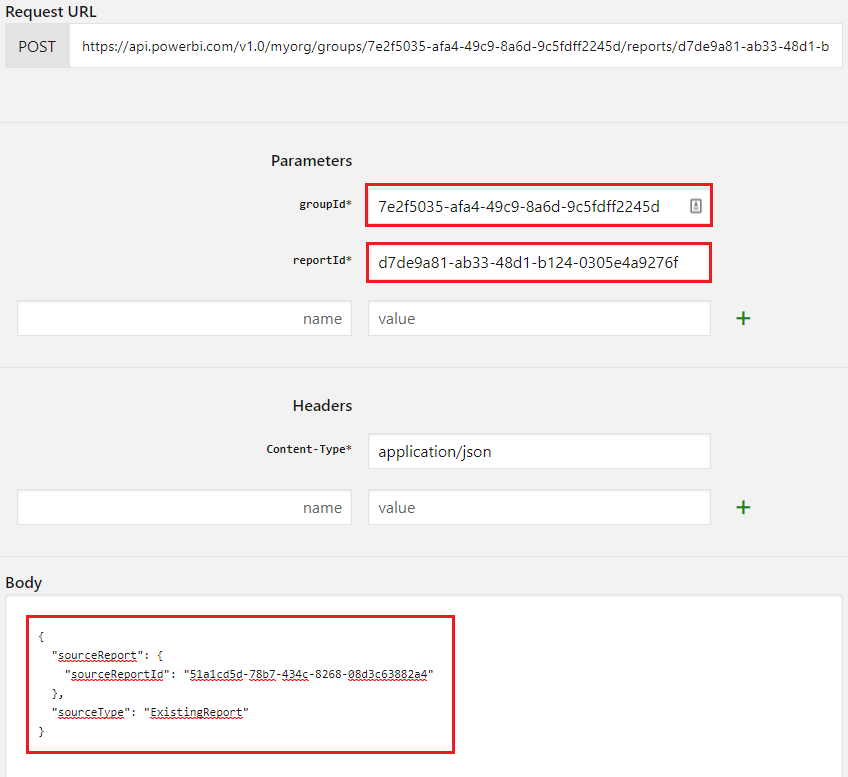

# Download PBIX for Report created in Service


*I've been there many times myself, and I have witnessed other people having the problem: The ability to create a new report directly in Power BI Service, connected to an existing dataset, is very powerful for its agility.*

*It comes with a huge limitation, though: **The resulting report cannot be downloaded as a PBIX file**, hence cannot be edited further in Power BI Desktop, or shared or archived as a file. Sometimes, new users aren't even aware of this, invest a lot of time and energy into building beautiful reports directly in the browser, only to realize later that they are now locked in.*

Here is the same problem reported in a Power BI Community Forum:

* [Can't download .pbix from report on service](https://community.powerbi.com/t5/Service/Can-t-download-pbix-from-report-on-service/td-p/854601)

**This article gives you a solution which works for anyone without any advanced technical skills.** It is based on two important insights:


1. For a report to be downloadable as a .pbix file, it must have been created in Power BI Desktop originally.
2. The `Update Report Content` API allows to swap the contents of any two reports in Power BI Service, provided they are connected to the same dataset.


Putting those two points together, we can come up with this process to download a report PBIX that was previously blocked from being downloaded:

1. Report `A` has been created from dataset `B` in Power BI Service, and cannot be downloaded.
2. In Power BI Desktop, create a new report `C` connected to the same dataset `B`, leave it otherwise empty, and upload it to the same workspace. This report **can** subsequently be downloaded as a .pbix file, even once edits have been made to it in the Service.
3. Use the [Update Report Content API](https://docs.microsoft.com/rest/api/power-bi/reports/updatereportcontentingroup) - which can be triggered interactively on that docs page - to update report `C` with the contents of report `A`.
4. Download report `C`, now containing all the pages, filters and visuals from the original report `A`, and make further edits in Power BI Desktop.

## Using the *Update Report Content* API

The API requires a POST request to be made to this url: `https://api.powerbi.com/v1.0/myorg/groups/{groupId}/reports/{reportId}/UpdateReportContent`.

`{groupId}` and `{reportId}` represent the report **to be updated**. In our case that is the one we've uploaded as an empty/dummy report from Power BI Desktop, report `C`.

The request must be made with a json body like this:

```javascript
{
  "sourceReport": {
    "sourceReportId": "8e4d5880-81d6-4804-ab97-054665050799",
    "sourceWorkspaceId": "2f42a406-a075-4a15-bbf2-97ef958c94cb"
  },
  "sourceType": "ExistingReport"
}
```

That describes the report the content is coming from, in our case report `A`. *`"sourceType": "ExistingReport"`* always has to be specified exactly like that.

If both reports are in the same workspace, `sourceWorkspaceId` does not need to provided, which simplifies the format further:

```javascript
{
  "sourceReport": {
    "sourceReportId": "8e4d5880-81d6-4804-ab97-054665050799"
  },
  "sourceType": "ExistingReport"
}
```

Let's start by collecting the necessary information. There are two reports in my workspace - one *Created in Service*, which cannot be downloaded, one *Created in PBI Desktop*, which can be downloaded:


The *Created in PBI Desktop* report is the one to be updated. Its url is: `https://app.powerbi.com/groups/7e2f5035-afa4-49c9-8a6d-9c5fdff2245d/reports/d7de9a81-ab33-48d1-b124-0305e4a9276f/ReportSection`.

Hence, I can extract:

* `groupId` = `7e2f5035-afa4-49c9-8a6d-9c5fdff2245d`
* `reportId` = `d7de9a81-ab33-48d1-b124-0305e4a9276f`

The *Created in Service* report is the source report, and its url is: `https://app.powerbi.com/groups/7e2f5035-afa4-49c9-8a6d-9c5fdff2245d/reports/51a1cd5d-78b7-434c-8268-08d3c63882a4/ReportSection`.

That gives me:

* `sourceReportId` = `51a1cd5d-78b7-434c-8268-08d3c63882a4`

## Invoking the *Update Report Content* API interactively

Let's navigate to the API Docs page for [Update Report Content](https://docs.microsoft.com/rest/api/power-bi/reports/updatereportcontentingroup). It has that really useful green "Try It" button:


Clicking this opens a new panel on the right with a *Sign in* button. Use that to sign in with your Power BI account:


Then, simply fill in the parameters collected earlier:



...and click the green "Run" button below:


If everything went well, "Response Code: 200" will be reported:


I can now open the report `C`, the one uploaded from Power BI Desktop earlier. It has exactly the same contents as report `A`, however, this one can also be downloaded!


Problem solved.
