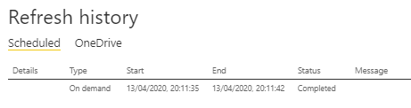

# Deploy through XMLA Endpoint with TOM

With the [Read/Write XMLA endpoint in public preview for Power BI Premium](https://powerbi.microsoft.com/blog/announcing-read-write-xmla-endpoints-in-power-bi-premium-public-preview/) as well as the [Power BI Enhanced "V3" Metadata Format in Preview](https://docs.microsoft.com/power-bi/desktop-enhanced-dataset-metadata), let's see what it takes to create, deploy, and modify a Power BI Premium hosted dataset using code only and the [TOM libraries](https://docs.microsoft.com/analysis-services/tom/introduction-to-the-tabular-object-model-tom-in-analysis-services-amo?view=power-bi-premium-current).

## Prerequisites

1. Power BI Premium capacity with the XMLA endpoint enabled for Read/Write.
2. A Power BI workspace assigned to the Premium capacity.
3. Access to the workspace at the _Contributor_ level or higher.
4. The latest [TOM client libraries](https://www.nuget.org/packages/Microsoft.AnalysisServices.retail.amd64/), _19.2_ at the time of writing.

## Enable XMLA Read/Write Mode

That is explained [here](https://docs.microsoft.com/power-bi/service-premium-connect-tools#enable-xmla-read-write) and requires a Power BI Tenant Admin to configure the capacity accordingly at [https://app.powerbi.com/admin-portal/capacities](https://app.powerbi.com/admin-portal/capacities).

Please note that this does not even require a full Power BI Premium account as the same functionality is available on any of the _Power BI Embedded_ capacities \(which are billed hourly and can be provisioned, paused, and deleted at any time, hence great for testing and POCs\). _Just Thorning Blindbæk_ has blogged about that approach [here](https://justb.dk/blog/2020/04/using-the-xmla-endpoint-without-premium/).


There is currently an issue when using a Power BI Embedded A SKU which prevents the Read/Write mode to be enabled successfully. The workaround for that is to either completely disable the _Dataflows_ workload on the capacity, or to limit the Dataflows _Max Memory \(%\)_ threshold to a maximum of 40%.


## Demo Setup

For this demo, we'll create a tiny model to ensure that code samples remain as simple as possible. To keep things interesting, though, we are going to connect to an on-prem SQL server, demonstrating that this approach works well even with a data gateway at play.

The model will connect to the `AdventureWorksDW2014` database, which can be retrieved [here](https://docs.microsoft.com/sql/samples/adventureworks-install-configure).

The full end-to-end script is available as a [LINQPad](https://www.linqpad.net/) script at the end.

Following common conventions, we're using two namespace aliases:

```csharp
using AMO = Microsoft.AnalysisServices;
using TOM = Microsoft.AnalysisServices.Tabular;
```

Furthermore, we'll need to reference this NuGet package: `Microsoft.AnalysisServices.retail.amd64`.

## Data Source/Query

Since we are replicating how Power BI creates datasets natively, we are using M/PowerQuery to load data into the model. The M query for this is extremely simple and only fetches three columns from the `DimCustomer` table:

```text
let
    Source = Sql.Database("YOUR_SERVER_NAME_HERE", "AdventureWorksDW2014"),
    dbo_DimCustomer = Source{[Schema="dbo",Item="DimCustomer"]}[Data],
    #"Select Columns" = Table.SelectColumns(dbo_DimCustomer,{"CustomerKey", "FirstName", "LastName"})
in
    #"Select Columns"
```

## Create V3 Model with one Table

```csharp
var model = new TOM.Model {
    DefaultPowerBIDataSourceVersion = TOM.PowerBIDataSourceVersion.PowerBI_V3,
    Description = $"Deployed at {DateTime.UtcNow:s}"
};
```

The `PowerBI_V3` version setting represents the new enhanced metadata format which was introduced as a preview feature in Power BI Desktop March 2020. It brings with it significant improvements regarding the interplay between the tabular engine and PowerQuery which we'll look at below.

The `Description` property is entirely optional, but allows us to easily verify our deployments since the field updates each time that model definition is sent to the server.

```csharp
var table = new TOM.Table { Name = "Customers" };
table.Columns.Add(new TOM.DataColumn {
    Name = "CustomerKey",
    DataType = TOM.DataType.Int64,
    IsHidden = true,
    SourceColumn = "CustomerKey",
    SummarizeBy = TOM.AggregateFunction.None
});
table.Columns.Add(new TOM.DataColumn {
    Name = "FirstName",
    DataType = TOM.DataType.String,
    SourceColumn = "FirstName",
    SummarizeBy = TOM.AggregateFunction.None
});
table.Columns.Add(new TOM.DataColumn {
    Name = "LastName",
    DataType = TOM.DataType.String,
    SourceColumn = "LastName",
    SummarizeBy = TOM.AggregateFunction.None
});
```

The three columns retrieved in the M code above are declared as model columns here, nothing special.

Finally, a simple measure is added so that the model can be consumed in a report more easily:

```csharp
table.Measures.Add(new TOM.Measure {
    Name = "Number of Customers",
    Expression = @"COUNTROWS(Customers)",
    FormatString = "0"
});
```

## Declare M query inline as part of table partition

This step is where the enhancements of the V3 metadata model are most visible. Queries are no longer encoded in special data source connection strings. Instead, those are declared as part of the corresponding table partition. In fact, the model does not even require the definition of explicit data sources - those are simply inferred by the engine.

```csharp
table.Partitions.Add(new TOM.Partition
{
    Name = "Customers-0001",
    Mode = TOM.ModeType.Import,
    Source = new TOM.MPartitionSource
    {
        Expression = String.Join("\n", new[] {
"let",
"    Source = Sql.Database(\"YOUR_SERVER_NAME_HERE\", \"AdventureWorksDW2014\"),",
"    dbo_DimCustomer = Source{[Schema=\"dbo\",Item=\"DimCustomer\"]}[Data],",
"    #\"Select Columns\" = Table.SelectColumns(dbo_DimCustomer,{\"CustomerKey\", \"FirstName\", \"LastName\"})",
"in",
"    #\"Select Columns\"" })
    }
});
```

This is the same M query as shown earlier, only broken down into multiple strings and with escape characters for inline double quotes.

All that's left to do now is to add the table to the model created above:

```csharp
model.Tables.Add(table);
```

## Connect to the Premium Workspace and Create the Database

```csharp
var dbName = "AdventureWorksDW2014";
using (var server = new TOM.Server())
{
    var connStrBldr = new SqlConnectionStringBuilder
    {
        DataSource = "powerbi://api.powerbi.com/v1.0/myorg/YOUR_WORKSPACE_NAME",
        UserID = "YOUR_AAD_USER_NAME",
        Password = "YOUR_AAD_PASSWORD"
    };
    server.Connect(connStrBldr.ConnectionString);
    server.Dump();

    if (!server.Databases.ContainsName(dbName))
    {
        var db = new TOM.Database(dbName)
        {
            CompatibilityLevel = 1520,
            StorageEngineUsed = AMO.StorageEngineUsed.TabularMetadata,
            Model = model
        };

        server.Execute(Microsoft.AnalysisServices.Tabular.JsonScripter.ScriptCreate(db)).Dump();
    }
    else
    {
        using (var serverDb = server.Databases.GetByName(dbName))
        {
            model.CopyTo(serverDb.Model);
            serverDb.Model.SaveChanges();
        }
    }
}
```

The script will create a new database with the `1520` _CompatibilityLevel_ \(which is required for the V3 metadata format\). If a database with the same name already exists its model will be updated instead. Hence, this approach can also be used for incremental model development.

The _DataSource_ connection string can be grabbed from the Premium-enabled Power BI workspace:


## First Run: Create a new database

After only a few seconds, Power BI shows a new dataset straight away:


However, the Gateway connection needs to be configured before the new dataset can be refreshed. This is only required once after creation and won't be necessary after any subsequent model changes.


Power BI has already recognized all data sources that require a gateway connection, and assuming those have been set up on a gateway, they can easily be configured in the settings for the dataset:


With that in place, a dataset refresh can be triggered via the Power BI UI, and it succeeds after only a few seconds since there is not very much data to load:



Let's create a report to verify that the dataset does indeed contain data:


This gives us the _Number of Customers_ by first name - not very insightful, but sufficient to demonstrate this is a fully functional Power BI dataset now!

## Connect to the Dataset via SSMS

The same connection string can also be used to connect via SSMS:


That allows us to verify the Model _Description_ property we've used for custom metadata earlier:


## Deploy a model change

First of all, the full script can simply be run again, and we would only expect the _Description_ property to change and no further dataset refresh to be necessary:


Let's make a more interesting change, though, and use another new feature the V3 model gives us: **Shared Expressions**. We're taking the currently hard-coded SQL server name out of the partition of the _Customers_ table, and define it as a single model-level parameter instead.

That also makes the example more realistic since any real-world dataset would surely have multiple tables/partitions connecting to the same external datasource. Defining that in only one place within the model makes it significantly easier to maintain, and also allows the model to be moved between environments more easily.

Our script only requires two modifications. Firstly, a _Named_ \(or _Shared_\) Expression is added:

```csharp
model.Expressions.Add(new TOM.NamedExpression {
    Name = "[SQL Server]",
    Kind = TOM.ExpressionKind.M,
    Expression = "\"YOUR_SERVER_NAME_HERE\" meta [IsParameterQuery=true, Type=\"Text\", IsParameterQueryRequired=true]"
});
```

Then, the existing partition declaration for the _Customers_ table is adjusted to use a M query reference rather than the actual server name \(`#"[SQL Server]"`\):

```csharp
table.Partitions.Add(new TOM.Partition
{
    Name = "Customers-0001",
    Mode = TOM.ModeType.Import,
    Source = new TOM.MPartitionSource
    {
        Expression = String.Join("\n", new[] {
"let",
"    Source = Sql.Database(#\"[SQL Server]\", \"AdventureWorksDW2014\"),",
"    dbo_DimCustomer = Source{[Schema=\"dbo\",Item=\"DimCustomer\"]}[Data],",
"    #\"Select Columns\" = Table.SelectColumns(dbo_DimCustomer,{\"CustomerKey\", \"FirstName\", \"LastName\"})",
"in",
"    #\"Select Columns\"" })
    }
});
```

_By convention, I generally surround M parameters with square brackets to visually distinguish them from proper M query names._

With those two changes, re-running the entire script doesn't take very long at all although we've made a relatively significant structural change.

One disappointment, however, is the discovery that Power BI is not \(yet\) recognizing those parameters as dataset parameters:


This is probably due to the preview status of the V3 model, and will hopefully be sorted out in the future.

We can verify that the change has gone through, though, by scripting the entire database in SSMS. The resulting TMSL script is indeed quite comprehensible:

```javascript
{
  "create": {
    "database": {
      "name": "AdventureWorksDW2014",
      "id": "XXXXXXXXXXXXXXX",
      "compatibilityLevel": 1520,
      "model": {
        "description": "Deployed at 2020-04-13T19:35:23",
        "culture": "en-US",
        "defaultPowerBIDataSourceVersion": "powerBI_V3",
        "tables": [
          {
            "name": "Customers",
            "columns": [
              {
                "name": "CustomerKey",
                "dataType": "int64",
                "isHidden": true,
                "sourceColumn": "CustomerKey",
                "summarizeBy": "none"
              },
              {
                "name": "FirstName",
                "dataType": "string",
                "sourceColumn": "FirstName",
                "summarizeBy": "none"
              },
              {
                "name": "LastName",
                "dataType": "string",
                "sourceColumn": "LastName",
                "summarizeBy": "none"
              }
            ],
            "partitions": [
              {
                "name": "Customers-0001",
                "mode": "import",
                "source": {
                  "type": "m",
                  "expression": [
                    "let",
                    "    Source = Sql.Database(#\"[SQL Server]\", \"AdventureWorksDW2014\"),",
                    "    dbo_DimCustomer = Source{[Schema=\"dbo\",Item=\"DimCustomer\"]}[Data],",
                    "    #\"Select Columns\" = Table.SelectColumns(dbo_DimCustomer,{\"CustomerKey\", \"FirstName\", \"LastName\"})",
                    "in",
                    "    #\"Select Columns\""
                  ]
                }
              }
            ],
            "measures": [
              {
                "name": "Number of Customers",
                "expression": "COUNTROWS(Customers)",
                "formatString": "0"
              }
            ]
          }
        ],
        "expressions": [
          {
            "name": "[SQL Server]",
            "kind": "m",
            "expression": "\"XXXXXXXXXXXXXXX\" meta [IsParameterQuery=true, Type=\"Text\", IsParameterQueryRequired=true]"
          }
        ]
      }
    }
  }
}
```

## Full Demo Scripts

The initial script as well as the updated version is available [in this Gist](https://gist.github.com/mthierba/33ee04af989562edb08b534755350a9a).

## Updates

### 2020-06-02

* Bumped AMO package version number to 19.2
* Changed the _Create New Database_ section of script as previous version was no longer working as expected in a Power BI Premium workspace (Data sources did not get recognized when an empty database was created first and then updated. The new script version generates a single command to create and define the entire database.)
